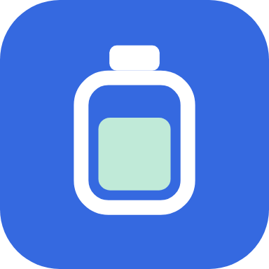
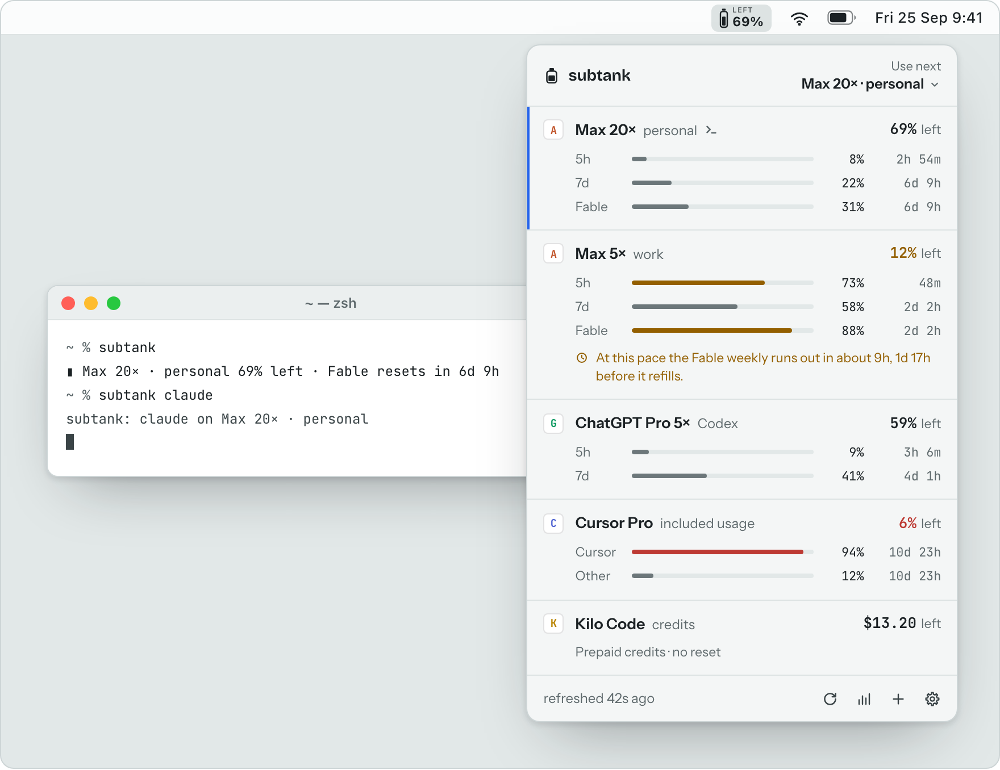
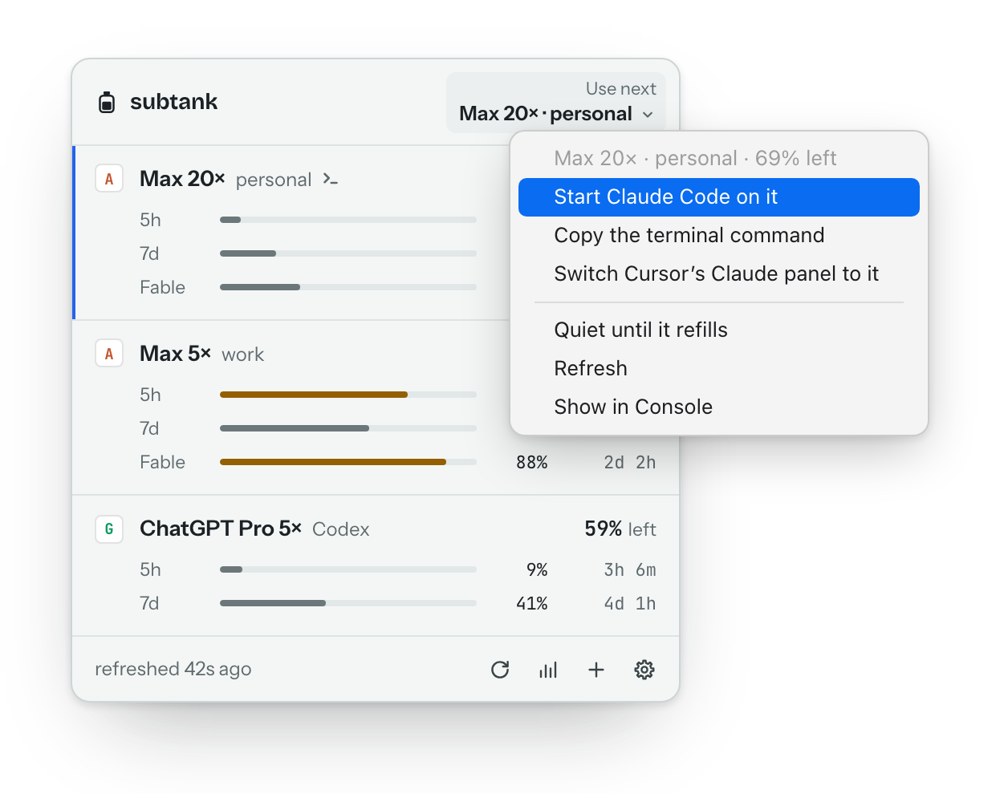

<div align="center">

<a href="https://subtank.dev"></a>

# subtank

**See what’s left in every AI plan.**<br>
모든 AI 요금제의 남은 한도를 한눈에.

subtank lives in your Mac’s menu bar and reads the limits of every AI plan you pay for —<br>
Claude, ChatGPT, Cursor, Copilot, Kilo, Ollama and your API keys — then tells you which account to use next.

<a href="https://subtank.dev/download/"></a>

or `brew install --cask subtank-dev/tap/subtank`

<sub>Free · macOS 13 or later · Apple silicon and Intel · English and 한국어</sub>

[Website](https://subtank.dev) · [Help](https://subtank.dev/help/) · [Changelog](https://subtank.dev/changelog/) · [Privacy](https://subtank.dev/privacy/)

<br>

<picture>
  <source media="(prefers-color-scheme: dark)" srcset=".github/assets/hero-dark.png">
  
</picture>

<sub>Example accounts and numbers. Yours appear once you tick them.</sub>

</div>

## Why subtank

If you pay for more than one AI plan — a second Claude Max for work, ChatGPT for Codex,
Cursor on the side — finding the one with room means opening a dashboard per account, or
hitting a limit halfway through a task and switching blind.

subtank reads them all and puts the answer in your menu bar: one number for the account to
use next, and a list with every limit, when it refills, and one click to start working on
the account that has room. It asks the tools you already use, and first launch opens no
login window: subtank looks at what is already signed in on your Mac and adds nothing until
you tick it.

## What you get

- **One number in the menu bar.** What is left on the account to use next, with a tiny
  “LEFT” over it so it is never mistaken for “used”. Rather see the service’s name, or the
  tank alone? Settings → General → Menu bar item.
- **Every account on one row.** Each limit gets a bar and a countdown to its reset: Claude’s
  5-hour and weekly windows and its per-model weekly limits such as Fable’s, Codex’s windows,
  Cursor’s two monthly pools, credits, balances and spend. What is left turns amber when it
  gets close and red when it is nearly out.
- **The account to use next.** Picked from live numbers only, on each account’s tightest
  limit. Between two close accounts, subtank suggests the one that lasts at the pace you are
  going.
- **A heads-up before you run out.** A row says so when an account will run out before it
  refills: “At this pace the Fable weekly runs out in about 9h, 1d 17h before it refills.”
- **One click to switch.** Start Claude Code or Codex on the account with room, straight from
  the list. [More below](#switch-accounts-in-one-click).
- **Alerts, if you want them.** At your threshold, at 95 % and at the limit, once per reset;
  when an account will run out before it refills; the evening before a mostly unused week
  refills. All off until you switch them on, and “Quiet until it refills” silences one account.
- **The Console** (<kbd>⌘</kbd> <kbd>Y</kbd> from the list). How each limit filled over time
  and the pace it is going at, what your plans cost and when they renew, and a diagnostics
  report for when something goes wrong.
- **Your terminal, too.** The `subtank` command prints the same answer and can be Claude
  Code’s status line. [More below](#in-your-terminal).
- **Hide personal info** turns every name into “Claude 1”, “Claude 2” for screen sharing.

## Switch accounts in one click

<p align="center">
  <picture>
    <source media="(prefers-color-scheme: dark)" srcset=".github/assets/switch-dark.png">
    
  </picture>
</p>

Click **Use next** at the top of the list, or right-click any Claude or Codex row:

- **Start Claude Code on it** (or Codex) opens Terminal with your own `claude` pointed at that
  account. <kbd>⌘</kbd> <kbd>⏎</kbd> in the list does it for the account to use next.
- **Copy the terminal command**, for a terminal that is already open.
- **Switch Cursor’s Claude panel to it.** subtank sets one entry in Cursor’s settings, after
  asking once, and keeps a copy of the file first. New conversations in the panel use that
  account; one already open keeps its own.

Nothing reads, copies or renews a sign-in: subtank only tells the tool which folder to use,
and a conversation that is running is never moved.

**When a session hits its limit**, subtank can say at once which account has room, with a
Switch button in the notification. Settings → Advanced has the hook to paste into Claude
Code’s settings.

## What it reads

| Service | What you see | How subtank reads it |
| --- | --- | --- |
| **Claude** Pro · Max | The 5-hour and weekly windows, each model’s weekly limit such as Fable’s, and usage credits when they are on | Your own Claude Code — no prompt, no model request |
| **ChatGPT · Codex** | Your plan, its usage windows, a workspace’s monthly credit limit, and earned resets | OpenAI’s own `codex app-server` |
| **Cursor** | The two monthly pools Cursor shows (Cursor models and Other models), on-demand spend, the billing cycle | The sign-in the Cursor app already holds, read-only, never renewed |
| **GitHub Copilot** | AI Credits: a paid plan’s monthly allowance and anything billed beyond it; Free’s chat and completions | The GitHub CLI’s token, for one request |
| **Kilo Code** | Credit balance, Kilo Pass credits, the next billing date | The Kilo CLI’s sign-in, or Kilo’s device code |
| **OpenRouter** | Credits, spend and a key’s limit | OpenRouter’s own Connect, or a key |
| **DeepSeek**, **Moonshot · Kimi** | The account balance | A key you paste, kept in your Keychain |
| **Anthropic API**, **OpenAI API** | This month’s spend for the organization | An Admin key |
| **xAI** | Whether the key works (xAI gives API keys no usage to read) | A key you paste, kept in your Keychain |
| **Ollama Cloud** <sup>experimental</sup> | Session and weekly limits, or the monthly one on newer plans | A key you paste; the numbers ollama.com shows you |
| **Anything else** | What you pay, when it renews, and a reminder before it does | The price and date you type in |

## Getting started

1. **Install.** Download the disk image from [subtank.dev/download](https://subtank.dev/download/)
   and drag subtank to Applications, or use Homebrew:

   ```sh
   brew install --cask subtank-dev/tap/subtank
   ```

   subtank is signed with its developer’s ID and notarized by Apple. Keep it in Applications
   so it can update itself.
2. **Open it.** There is no login window. subtank takes a read-only look at what is already
   signed in on your Mac — Claude Code, Codex, Cursor, Kilo, the GitHub CLI — and shows what
   it found.
3. **Tick what to add.** Before anything is added, one line says which hosts that will
   contact. Each account is then read by its vendor’s own tool or the sign-in already on your
   Mac.
4. **Glance.** Click the tank in the menu bar, or press <kbd>⌥</kbd> <kbd>⇧</kbd> <kbd>Space</kbd>
   from anywhere.

To add another account later — a second Claude account, a Codex sign-in, a key — click
**＋** at the foot of the list. A second Claude account gets Claude Code’s own browser
sign-in, into a profile of its own, so your current Claude Code login stays as it is.

<details>
<summary><b>What each service needs</b></summary>
<br>

| Service | What it needs |
| --- | --- |
| Claude | Claude Code, installed and signed in. More accounts: ＋ → Claude, which runs Claude Code’s own browser sign-in. |
| ChatGPT · Codex | The Codex CLI, or the ChatGPT app (subtank uses the `codex` inside it), signed in with ChatGPT. A sign-in with an API key has no plan limits to read. |
| Cursor | The Cursor app, signed in. If Cursor needs to renew its sign-in, open it once. |
| GitHub Copilot | The GitHub CLI, signed in: run `gh auth login`, then “Scan this Mac again”. |
| Kilo Code | The Kilo CLI, signed in, or Kilo’s device code from ＋. |
| OpenRouter | OpenRouter’s Connect, in your browser, or a key. |
| DeepSeek, Moonshot · Kimi | An API key. |
| Anthropic API, OpenAI API | An Admin key (`sk-ant-admin01-…`, `sk-admin-…`). An ordinary key cannot read usage or cost. |
| xAI | An API key. |
| Ollama Cloud | An API key from ollama.com. |
| Anything else | Nothing: type the price and the renewal date. |

</details>

## In your terminal

```console
$ subtank
▮ Max 20× · personal 69% left · Fable resets in 6d 9h
$ subtank claude               # Claude Code, on the Claude account to use next
$ subtank claude --as work     # …or on the account you nicknamed “work”
$ subtank codex                # the same for Codex
$ subtank next                 # the account to use next, per service
$ subtank json                 # every account, as JSON
$ eval "$(subtank env claude)" # point this shell at the account to use next
```

To see it under Claude Code’s prompt, make it the status line in `~/.claude/settings.json`:

```json
{
  "statusLine": { "type": "command", "command": "subtank status" }
}
```

The Homebrew cask puts `subtank` on your PATH; from the disk image it is at
`/Applications/subtank.app/Contents/Resources/bin/subtank`, and Settings → Advanced shows the
exact block for your copy. The command only reads a file the app keeps current: it holds no
token and talks to no one.

`subtank://` links drive the app from Raycast, Shortcuts or a Stream Deck: `subtank://open`,
`refresh`, `settings`, `console`, `add`, and `switch?account=…`, which shows that account’s
menu and never switches by itself.

## Privacy

> **No account, no telemetry. The only request to a subtank server is the update check.**

- **First launch only looks.** A fixed list of places on your Mac, to see what is signed in and
  as whom. No network, no password, no vendor tool started.
- **Nothing reaches a service until you add an account for it**, and then only that service.
- **Your sign-ins stay yours.** Claude Code, Codex, Cursor and the GitHub CLI keep and renew
  their own; subtank never renews one and never reads another app’s Keychain item. Removing
  an account deletes only what subtank created for it.
- **What subtank keeps stays on your Mac**: its settings and history in
  `~/Library/Application Support/subtank`, and the keys you paste in your Keychain.
- **Honest numbers, or none.** A number a service did not give is a dash, “—”, never 0. A
  failed read keeps the last numbers, dimmed with their age, and subtank will not recommend an
  account from them.

The [privacy page](https://subtank.dev/privacy/) lists every host each service talks to, and
what the update server logs and for how long.

## Questions

<details>
<summary><b>Why is there no Claude sign-in window?</b></summary>
<br>

Because subtank never signs in to Claude itself. Claude’s numbers come from your own Claude
Code: subtank runs the `claude` you installed and asks it for its usage — the same numbers
Claude Code shows you, with no model request. Anthropic’s terms rule out signing in to
claude.ai inside other apps, and Claude Code renews its sign-in with a single-use token, so an
app that renewed it would sign Claude Code out. Sign in to Claude Code as you always do, and
subtank finds it.

</details>

<details>
<summary><b>Can it follow more than one Claude account?</b></summary>
<br>

Yes — that is what it was made for. The account Claude Code uses now needs nothing extra. For
each other account, choose ＋ → Claude → Sign in with your browser: Claude Code’s own sign-in
runs into a separate profile inside subtank’s folder, which never switches away, and your
current login stays as it is. A small prompt sign, `>_`, marks the account Claude Code is
signed in to right now.

</details>

<details>
<summary><b>Why does <code>claude</code> show up in Activity Monitor?</b></summary>
<br>

Each Claude read starts your own `claude`, asks it for its usage and lets it quit a few
seconds later: no prompt, no model request, nothing in your history. On its own, subtank
reads each Claude account at most every 5 minutes.

</details>

<details>
<summary><b>Will macOS ask for my password?</b></summary>
<br>

Not for other apps’ sign-ins: subtank only checks that Claude Code’s and Codex’s Keychain
items exist, which raises no prompt. It keeps its own items — keys you paste, Kilo and
OpenRouter sign-ins — under the service “subtank”. A different copy of subtank, such as one
restored onto a new Mac, is asked once; updates come from the same developer and are not.

</details>

<details>
<summary><b>I can’t see the icon in the menu bar</b></summary>
<br>

Press <kbd>⌥</kbd> <kbd>⇧</kbd> <kbd>Space</kbd> to open the list, or open subtank again from
Applications. On a MacBook with a notch, icons that do not fit beside it are hidden: quit a
few menu-bar apps or use a menu-bar manager. On macOS 26 and later, check System Settings →
Menu Bar → Allow in the Menu Bar.

</details>

<details>
<summary><b>How does it update?</b></summary>
<br>

subtank checks for a new version about every six hours and downloads it by itself. By
default it installs once your Mac has been idle for 10 minutes and no subtank window is open;
Settings → General can make it wait until you quit, or move you to the Beta channel. After the
first update, only the parts that changed are downloaded.

</details>

<details>
<summary><b>How do I uninstall it?</b></summary>
<br>

Start with Settings → Advanced → Reset everything, which removes your accounts, the profiles
subtank created and its own Keychain items. Then quit subtank and drag it to the Trash, or run
`brew uninstall --zap --cask subtank`. Nothing subtank reads belongs to it: `~/.claude`,
`~/.codex`, Cursor and the GitHub CLI stay exactly as they are.

</details>

More answers are in [Help](https://subtank.dev/help/).

## Feedback

Found a bug, or missing a service? [Open an issue](https://github.com/subtank-dev/subtank/issues/new)
and say which service it is about and what you saw. The quickest way to add the rest: in
subtank’s Console, choose **Diagnostics → Copy report** and paste it in. The report carries
no emails, names or keys.

> [!WARNING]
> Never paste a token, an API key, or a file such as `auth.json` or `.claude.json` into an
> issue. Nobody working on subtank will ask for one.

What changed in each version is in the [changelog](https://subtank.dev/changelog/) (also an
[Atom feed](https://subtank.dev/changelog/feed.xml)), and every download is on
[Releases](https://github.com/subtank-dev/subtank/releases).

---

<sub>subtank is free to download and use; see the [terms](https://subtank.dev/terms/).
© 2026 Deokwon Song. subtank and the tank icon are trademarks of the author. Claude and Claude
Code are trademarks of Anthropic, PBC; OpenAI, ChatGPT and Codex of OpenAI; Cursor of
Anysphere, Inc.; GitHub and Copilot of GitHub, Inc. Other product names belong to their owners
and are used only to name the services subtank reads. subtank is independent and is not
affiliated with, endorsed or sponsored by any of them.</sub>
